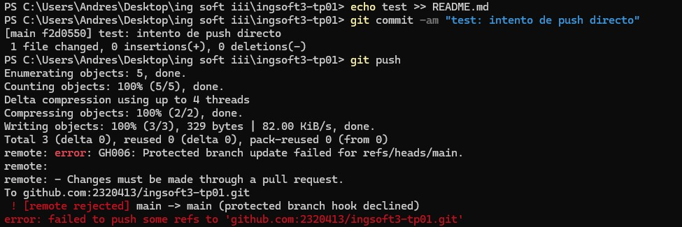
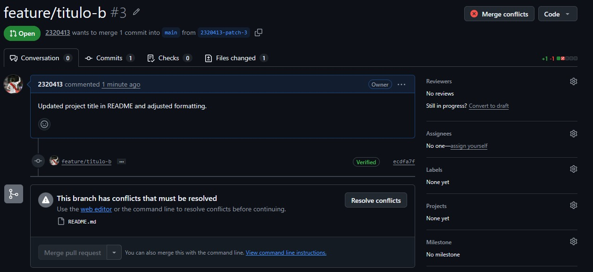
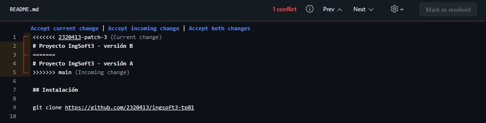
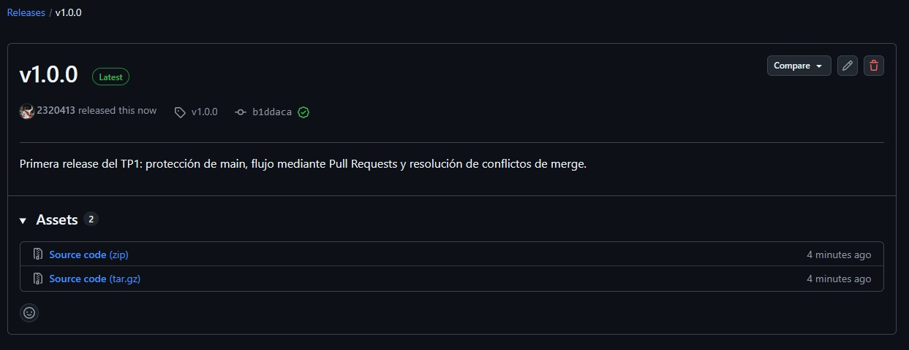

# Evidencias — TP1

## 1. Push directo a main rechazado



GitHub rechaza el intento de push directo a `main` porque la rama está protegida y la regla también se aplica al administrador del repositorio.

## 2. Conflicto en el Pull Request



El Pull Request de `feature/titulo-b` no puede integrarse automáticamente porque `main` y la rama modificaron la misma línea del archivo `README.md`.

## 3. Marcadores del conflicto



Git muestra los marcadores del conflicto para identificar las dos versiones de la misma sección. La resolución requiere decidir manualmente qué contenido conservar.

## 4. Release v1.0.0



Release `v1.0.0` publicada luego de completar el flujo de Pull Requests, la protección de `main` y la resolución del conflicto.

## TP2 — Contenedores

### 1. Aplicación ejecutándose con Docker Compose

Se levantó el sistema completo utilizando:

```bash
docker compose up --build
```

Docker Compose inició correctamente los tres servicios:

- `frontend`
- `backend`
- `db`

El frontend quedó disponible en:

```text
http://localhost:3000
```

El backend quedó disponible en:

```text
http://localhost:8080
```

PostgreSQL quedó accesible internamente mediante el servicio:

```text
db:5432
```

La aplicación pudo cargar correctamente los vehículos desde PostgreSQL a través del backend.

```text
img/tp2-compose-funcionando.png
```

---

### 2. Healthcheck de PostgreSQL

Durante el inicio de Docker Compose se verificó que PostgreSQL alcanzara el estado:

```text
Healthy
```

El backend espera a que la base de datos esté disponible antes de iniciar.

Esto se implementó utilizando `pg_isready` en el healthcheck del servicio `db`.

**Evidencia sugerida:**

```text
img/tp2-db-healthy.png
```

---

### 3. Migraciones automáticas

Al iniciar la aplicación con una base de datos vacía, Entity Framework Core aplicó automáticamente la migración:

```text
InitialCreate
```

La migración creó la tabla:

```text
Vehiculos
```

Luego se insertaron los datos iniciales utilizados por la aplicación.

Esto se logró agregando:

```csharp
await db.Database.MigrateAsync();
```

al inicio del backend.

**Evidencia sugerida:**

```text
img/tp2-migraciones.png
```

---

### 4. Persistencia de datos

Se comprobó la persistencia del volumen de PostgreSQL.

Primero se ejecutó:

```bash
docker compose down
```

y posteriormente:

```bash
docker compose up
```

Los datos continuaron disponibles después de recrear los contenedores.

Esto confirmó que el volumen:

```text
postgres_data
```

mantiene la información almacenada independientemente del ciclo de vida de los contenedores.

---

### 5. Eliminación del volumen

También se realizó la prueba:

```bash
docker compose down -v
```

Docker eliminó:

- frontend;
- backend;
- base de datos;
- red de Docker Compose;
- volumen de PostgreSQL.

En la salida se observó:

```text
Volume ingsoft3-tp01_postgres_data Removed
```

**Evidencia:**

```text
img/tp2-down-v.png
```

Luego se ejecutó nuevamente:

```bash
docker compose up
```

La aplicación pudo iniciar desde cero.

Entity Framework Core volvió a aplicar las migraciones y cargar los vehículos iniciales.

---

### 6. Aplicación funcionando luego de eliminar el volumen

Después de ejecutar `docker compose down -v`, se volvió a levantar el sistema.

La aplicación quedó funcionando nuevamente en:

```text
http://localhost:3000
```

Se visualizaron correctamente:

- Bravado Banshee;
- Pegassi Zentorno;
- Truffade Adder.

Esto demostró que una instalación limpia puede reconstruir automáticamente la base de datos.

**Evidencia:**

```text
img/tp2-app-desde-cero.png
```

---

### 7. Dockerfiles multi-stage

Se utilizaron Dockerfiles multi-stage tanto para backend como para frontend.

#### Backend

Imagen utilizada para compilación:

```text
mcr.microsoft.com/dotnet/sdk:8.0
```

Tamaño aproximado:

```text
1.2 GB
```

Imagen final publicada:

```text
ghcr.io/2320413/los-santos-auto-market-backend:v0.1.0
```

Tamaño aproximado:

```text
334 MB
```

Esto representa una reducción aproximada del 72%.

#### Frontend

Imagen utilizada para compilación:

```text
node:22-alpine
```

Tamaño aproximado:

```text
232 MB
```

Imagen final publicada:

```text
ghcr.io/2320413/los-santos-auto-market-frontend:v0.1.0
```

Tamaño aproximado:

```text
97.9 MB
```

Esto representa una reducción aproximada del 58%.

**Evidencia:**

```text
img/tp2-tamanos-imagenes.png
```

---

### 8. Publicación en GitHub Container Registry

Se publicaron las imágenes del frontend y backend en GitHub Container Registry.

Backend:

```text
ghcr.io/2320413/los-santos-auto-market-backend:v0.1.0
```

Frontend:

```text
ghcr.io/2320413/los-santos-auto-market-frontend:v0.1.0
```

Ambas imágenes fueron configuradas como públicas.

**Evidencia sugerida:**

```text
img/tp2-ghcr-packages.png
```

---

### 9. Ejecución desde imágenes públicas

Se creó el archivo:

```text
docker-compose.registry.yml
```

Este archivo utiliza las imágenes publicadas en GHCR en lugar de ejecutar un build local.

Para comprobarlo se eliminaron las imágenes locales de la aplicación y se ejecutó:

```bash
docker compose -f docker-compose.registry.yml up
```

Docker descargó las imágenes publicadas y levantó nuevamente los tres servicios.

La aplicación funcionó correctamente en:

```text
http://localhost:3000
```

**Evidencia:**

```text
img/tp2-registry-funcionando.png
```

---

### Resultado final

El trabajo permitió comprobar:

- construcción de imágenes mediante Dockerfiles multi-stage;
- ejecución de frontend, backend y PostgreSQL mediante Docker Compose;
- comunicación entre servicios mediante la red interna de Compose;
- persistencia mediante volúmenes;
- healthcheck de PostgreSQL;
- configuración mediante variables de entorno;
- migraciones automáticas con Entity Framework Core;
- publicación de imágenes versionadas en GHCR;
- ejecución completa de la aplicación utilizando imágenes públicas del registry.